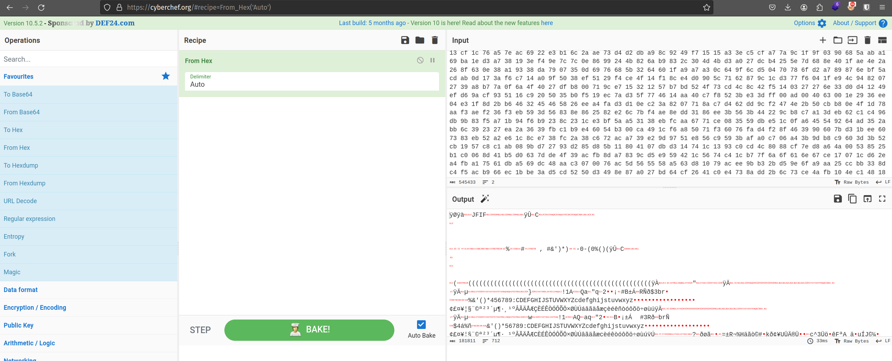
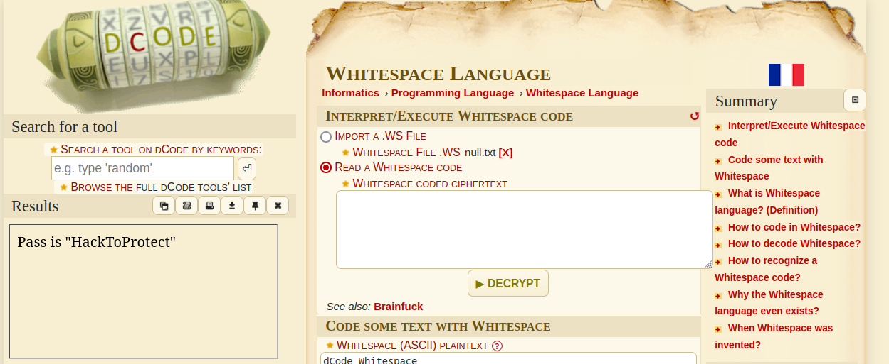

<div>
Date: 24-12-2023
</div>
<div>
Author: <b>!S1CK</b>
</div>

The challenge can be found [here](https://www.dc91181.org/challenges/week1)

<br>

### Solution

<br>

After reading the description, we can say that we will have to use some __forensics__, __cryptic__, and __steganograpgy__ tools to solve this challenge.

<br>

Firstly, we can see the zipped resource, so we will just unzip it.

<br>

```bash
root@host# unzip challenge-week-1-main.zip 
Archive:  challenge-week-1-main.zip
4658b1d2bcbeb15a25b5fc5fa04953a80914e4a9
   creating: challenge-week-1-main/
  inflating: challenge-week-1-main/README.md  
  inflating: challenge-week-1-main/resources.zip  

root@host# cd challenge-week-1-main
```

<br>
<br>

Once we [cd](https://man7.org/linux/man-pages/man1/cd.1p.html) into the `challenge-week-1-main` directory, we find a `README.md` and `resources.zip`. The `README.md` contains the same description that we can read on the url provided above. 
Upon unzipping the `resources.zip` in the similar manner we did with `challenge-week-1-main`, we will just go into the `resources` directory.

<br>

```bash
root@host# cd resources
```

<br>
<br>

We encounter a `secret.png` and if we try to open it, we face some issues (just as described in the description).


<br>
<br>
<br>


Even if we try to open the jpg with multiple commands like [eog](https://docs.oracle.com/cd/E88353_01/html/E37839/eog-1.html) or [mpv](https://man.archlinux.org/man/mpv.1) or [xdg-open](https://linux.die.net/man/1/xdg-open) or if we just double click on the image, we fail to open it.

This means that the file is corrupted or maybe this isn't an image at all. To check that, we will use the [file](https://man7.org/linux/man-pages/man1/file.1.html) command with this jpg.

```bash
root@host# file secret.png      
secret.png: Zip archive data, at least v2.0 to extract, compression method=deflate
```
<br>
<br>

We can see that this wasn't an image indeed. This is a zip archive, so let's rename it as __.zip__ and try to unzip it.

<br>

```bash
root@host# mv secret.png secret.zip                                      
secret.png                                                                                                        
secret.zip

root@host# unzip secret.zip    
Archive:  secret.zip
  inflating: vault/null.txt          
  inflating: vault/secret.txt        
```

<br>
<br>

Let's head inside this `vault` folder to see what's up.

<br>

```bash
root@host# cd vault

root@host# ls

null.txt  secret.txt
```

<br>

we find that there are two txt files. upon further inspection, we can see that `null.txt` seems to be empty but with something suspicious going on. Although it is empty, it still has some lines of storage.

the `secret.txt` file is having some data in a single line that looks like a `hex-code`. To check our claims let's head to [cyberchef](https://gchq.github.io/CyberChef/). We can either open our `secret.txt` as input or we can just copy paste its contents into the input.

We will use the ___From Hex___ operation on our input. Well will find the output to be as follows

<br>

```bash
ÿØÿà JFIF      ÿÛ C   


		
%# , #&')*)-0-(0%()(ÿÛ C   



(((((((((((((((((((((((((((((((((((((((((((((((((((ÿÀ   " ÿÄ            	

ÿÄ µ   } !1AQa "q2‘¡#B±ÁRÑð$3br‚	
%&'()*456789:CDEFGHIJSTUVWXYZcdefghijstuvwxyzƒ„…†‡ˆ‰Š’“”•–—˜™š¢£¤¥¦§¨©ª²³´µ¶·¸¹ºÂÃÄÅÆÇÈÉÊÒÓÔÕÖ×ØÙÚáâãäåæçèéêñòóôõö÷øùúÿÄ         	

ÿÄ µ   w !1AQ aq"2B‘¡±Á	#3RðbrÑ
$4á%ñ&'()*56789:CDEFGHIJSTUVWXYZcdefghijstuvwxyz‚ƒ„…†‡ˆ‰Š’“”•–—˜™š¢£¤¥¦§¨©ª²³´µ¶·¸¹ºÂÃÄÅÆÇÈÉÊÒÓÔÕÖ×ØÙÚâãäåæçèéêòóôõö÷øùúÿÚ   ? ðø㠂=±R¬%Häãò©#kð¢¥UÜĮ܃‚ c^3Üö“êFªA äŒuÍJ©¼£ ©ãj P~˜"&cØ
<snip>
```

<br>



<br>

Well the `JFIF` in the starting indicates that this is the data of a jpg file. So we wil just save this image via _Save output to file option_. I will save it as `download.jpg`.

<br>

If we open this file, we see the image of a ___cat___. This might be a hint to using the [cat](https://www.man7.org/linux/man-pages/man1/cat.1.html) command somewhere, but I will let you huys explore that on  yourself.

<br>
<br>
<br>
<br>

Now going back to the `null.txt`, I first simply searched `ctf empty character character file` on google, which gave me [these results](https://www.google.com/search?q=ctf+empoty+characters+character+file&client=firefox-b-d&sca_esv=592538007&sxsrf=AM9HkKmopy_wdiSNgfUeVi173HVV7FIczQ%3A1703083894314&ei=dv-CZf-0EtD8wAOswoewAQ&ved=0ahUKEwj_x6v0oZ6DAxVQPnAKHSzhARYQ4dUDCBA&uact=5&oq=ctf+empoty+characters+character+file&gs_lp=Egxnd3Mtd2l6LXNlcnAiJGN0ZiBlbXBvdHkgY2hhcmFjdGVycyBjaGFyYWN0ZXIgZmlsZTIEECEYCkj2J1DaA1jjJnACeAGQAQCYAeAEoAGELqoBDDAuNy4xMi4yLjAuMrgBA8gBAPgBAcICChAAGEcY1gQYsAPCAggQIRigARjDBMICChAhGKABGMMEGArCAggQABiABBiiBOIDBBgAIEGIBgGQBgg&sclient=gws-wiz-serp). I went on the understant [this ZWSP](https://www.google.com/url?sa=t&rct=j&q=&esrc=s&source=web&cd=&cad=rja&uact=8&ved=2ahUKEwiTysvUtJ6DAxW_hq8BHS2gDjIQFnoECBIQAQ&url=https%3A%2F%2Fcaptainnoob.medium.com%2Fzero-width-space-steganography-zwsp-ctf-92e1c414c378&usg=AOvVaw2axYCRH3D66Xc_Z_0RfTKq&opi=89978449) blog but it didnt seem to help.

<br>

I tried the python technique to see the hex-characters in the file by opening the interactive mode of python or IDLE and just pasting the entire content of `null.txt` as a multiline string with three quotes.

<br>

```bash
root@host# python
Python 3.11.6 (main, Nov 14 2023, 09:36:21) [GCC 13.2.1 20230801] on linux
Type "help", "copyright", "credits" or "license" for more information.
>>> '''                     
...     
...                             
...     
...                                             
...     
...                                             
...     
...                  
...     
...                                     
...     
...                                             
...     
...                  
...     
...                      
...     
...                        
...     
...                             
...     
...                                     
...     
...                                             
...     
...                               
...     
...                                                     
...     
...                         
...     
...                                      
...     
...                                                     
...     
...                                       
...     
...                                     
...     
...                                     
...     
...                                       
...     
...                      
...     
...   
... '''
'   \t \t    \n\t\n     \t\t    \t\n\t\n     \t\t\t  \t\t\n\t\n     \t\t\t  \t\t\n\t\n      \t     \n\t\n     \t\t \t  \t\n\t\n     \t\t\t  \t\t\n\t\n      \t     \n\t\n      \t   \t \n\t\n     \t  \t   \n\t\n     \t\t    \t\n\t\n     \t\t   \t\t\n\t\n     \t\t \t \t\t\n\t\n     \t \t \t  \n\t\n     \t\t \t\t\t\t\n\t\n     \t \t    \n\t\n     \t\t\t  \t \n\t\n     \t\t \t\t\t\t\n\t\n     \t\t\t \t  \n\t\n     \t\t  \t \t\n\t\n     \t\t   \t\t\n\t\n     \t\t\t \t  \n\t\n      \t   \t \n\t\n  \n'
>>> 
```

<br>

But it is clear that there is no scope for ZWSP here as there are only empty-spaces, tabs and newlines here. Upon further research, I came to know about [__Whitespace Language Encryption__]("https://en.wikipedia.org/wiki/Whitespace_(programming_language)")

<br>

So to decrypt this cryptic language, I went to __[decode.fr](https://www.dcode.fr/)__ and they had a solution for me [here](https://www.dcode.fr/whitespace-language)

<br>

Using the options provided on the __decode.fr__ page, we could wither select the `null.txt` file or paste it contents as input. We will get the output as

<br>



<br>

```txt
Pass is "HackToProtect"
```


<br>
<br>

I wonder where this password can be used?...

<br>

If we remeber, there was mention of steganography and [`steghide`](https://steghide.sourceforge.net/documentation/manpage.php) is a tool that uses steganography with JPGs using password (I know it from experience). So we will try to extract data from the `download.jpg` that we got from `secret.txt`.

<br>

```bash
root@host# steghide extract -sf download.jpg -xf output_file.txt -p HackToProtect              

wrote extracted data to "output_file.txt".
```

<br>

You can ask about the flags and syntax of steghide to extract a file from ChatGPT, it is pretty accurate. We can see that last line says _wrote extracted data to "output_file.txt"._ which means output file hash been created. Let's see what is inside it.

<br>

```bash
root@bash# cat output_file.txt 
File: output_file.txt
4d 5a 57 47 43 5a 33 33 49 4d 32 48 49 34 32 37 47 52 5a 44 47 58 5a 55 4e 52 33 54 49 36 4c 54 4c 35 52 58 4b 35 
42 54 48 35 36 51 3d 3d 3d 3d

```

<br>

This seems like hex-code again. Let's go back to CyberChef for this. We recieve the output as...

<br>

```txt
MZWGCZ33IM2HI427GRZDGXZUNR3TI6LTL5RXK5BTH56Q====
```
<br>

This seems like __[Base32](https://en.wikipedia.org/wiki/Base32)__. Lets use the ___From Base32___ operator in cyberchef to decode this. We recieve:

<br>

```txt
flag{C4ts_4r3_4lw4ys_cut3?}
```

<br>

This seems like a flag to me. Let's try submitting it to the [discord channel](https://discord.com/channels/856078990808317974/1185707756137746442).

```txt
/submit-flag flag{C4ts_4r3_4lw4ys_cut3?}
```

<br>

And this gets accepted!!!
