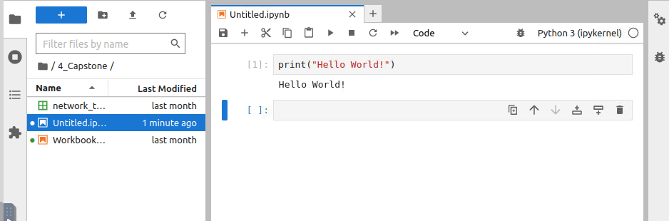
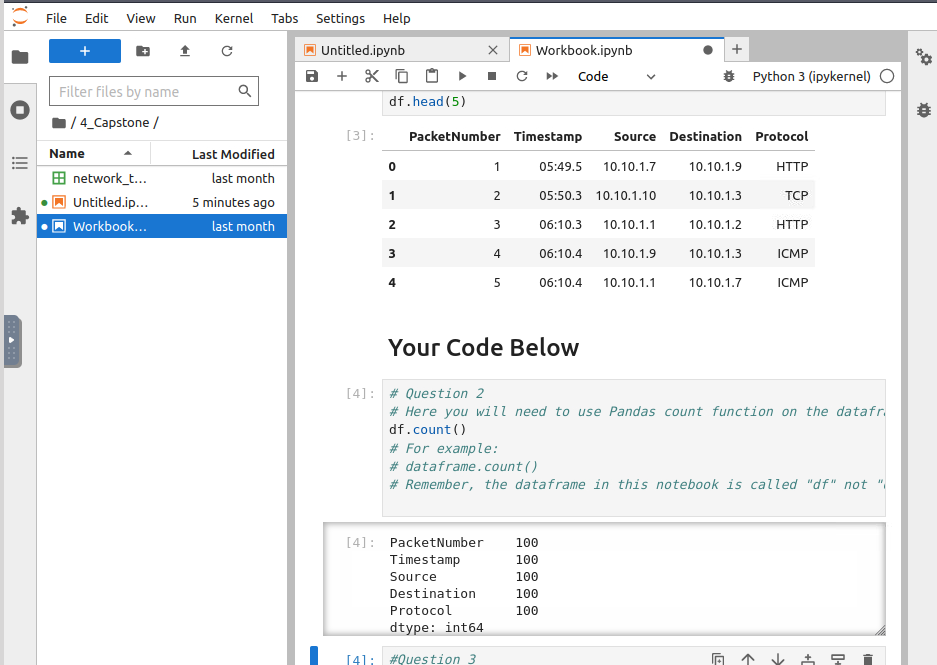
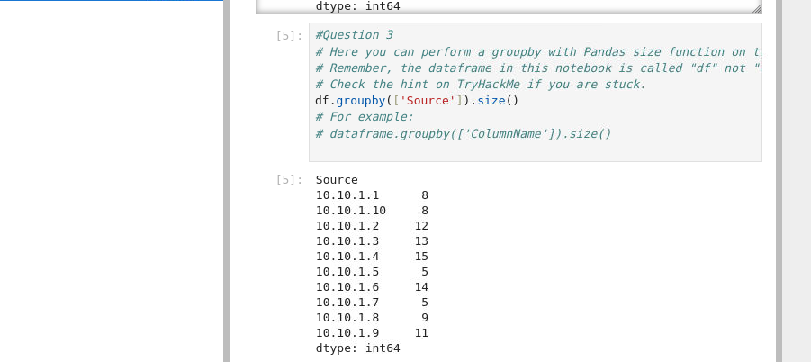
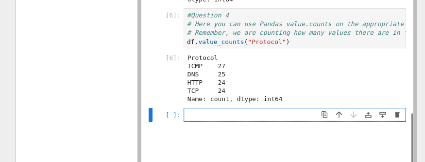

In this task we will learn how data science can be applied in Cybersecurity. We will also work with some popular Python libraries such as Pandas and Matplotlib to crunch data.

To start solving the task start the machine and click on show split view. We will see Jupyter Notebook in the split view.


Let's print hello world. To print hello word, first write the below command and then click on run button.
```python
print("Hello World!")
```



We can see the output printing "Hello World!".

## How many packets were captured (looking at the PacketNumber)?

To solve this task first open `workbook.ipynb`. Now scroll down and write the below code in the code block.
```python
df.count()
```
We can use this count() function to determine how many packets were captured. Now run each of the code block one by one and we got the count.



## What IP address sent the most amount of traffic during the packet capture?
For this task, we need to group using the `Source` column and then use the `size()` function to determine the counts for each IP address. Trype the below command and run.
```python
df.groupby(['Source']).size()
```



We can see the IP address which has sent the most number of packets.

## What was the most frequent protocol?

We can use "value.counts" function to complete this task. Type the below code and run.
```python
df.value_counts("Protocol")
```



---
Date: 18-12-2024 <br />
Author: W!LD_QU4K3