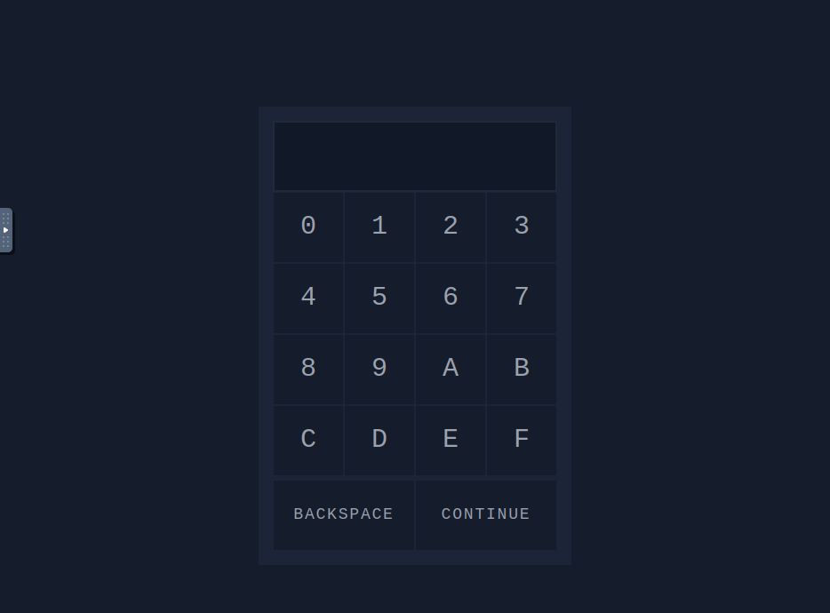
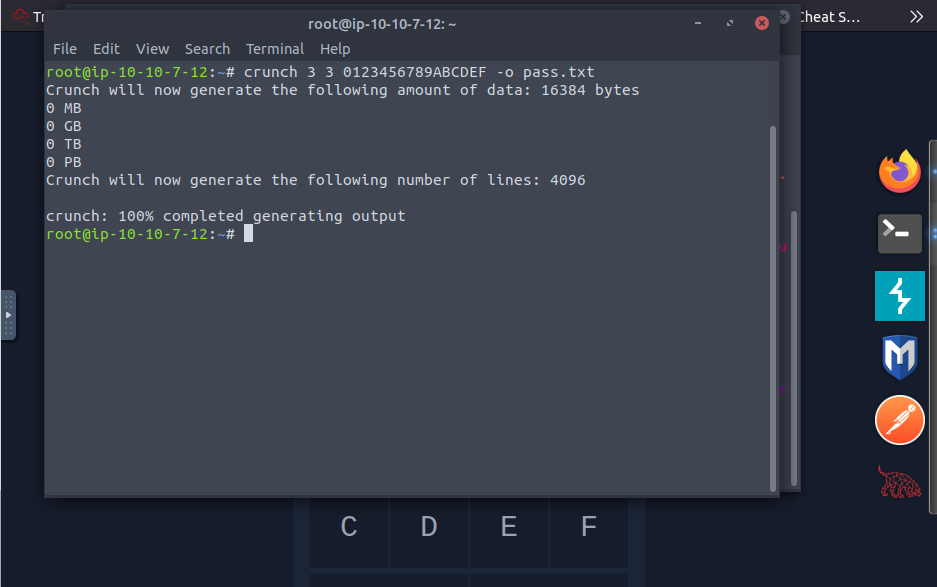
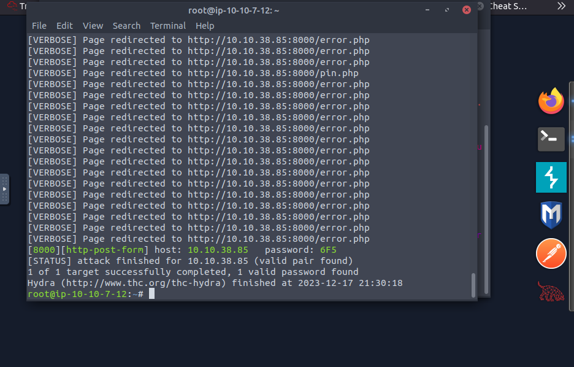

In this task we will learn about password complexity and the number of possible combinations. How the number of possible combinations affects the feasibility of brute force attacks. Generating password combinations using `crunch` and trying out passwords automatically using `hydra`.

To solve the task start the machine. Now connect to the network using openvpn or use attackbox and visit http://IP:8000/. We can see a web page.



## Using `crunch` and `hydra`, find the PIN code to access the control system and unlock the door. What is the flag?

So, in this task we have to bruteforce the pin to unlock this the door. By trying to enter a ping we can see that it only take 3 digit pin. So lets generate a wordlist containing 3 digit pins using the characters "0123456789ABCDEF".

We’ll make use of `Crunch`, a program that, given certain parameters, compiles a list of every potential password combination.
```bash
crunch 3 3 0123456789ABCDEF -o pass.txt
```
- `3`: the first number is the minimum length.
- `3`: the secon number is the maximum length.
- `0123456789ABCDEF`: are the character to use to generate the passwords.
- `-o pass.txt`: saves the output to a file pass.txt.



Now, we will use hydra to bruteforce the password using the wordlist that we have generated.

```bash
hydra -l '' -P pass.txt -f -v 10.10.38.85 http-post-form "/login.php:pin=^PASS^:Access denied" -s 8000
```
- `-l ''`: indicates that the username is blank
- `-P pass.txt`: specifies the password wordlist file
- `-f`: stops Hydra after finding password
- `-v`: provides verbose output
- `10.10.38.85` is the IP address of the target
- `http-post-form`: specifies the HTTP method to use
- `"/login.php:pin=^PASS^:Access denied"`: `/login.php` is the page where the PIN is submitted, pin=^PASS^ will replace ^PASS^ with values from the wordlist, `Access denied`` indicates that invalid passwords will lead to a page that contains the text “Access denied”.
- `-s 8000`: indicates the port number.



---
Date: 18-12-2023 <br />
Author: W1LD_QU4K3